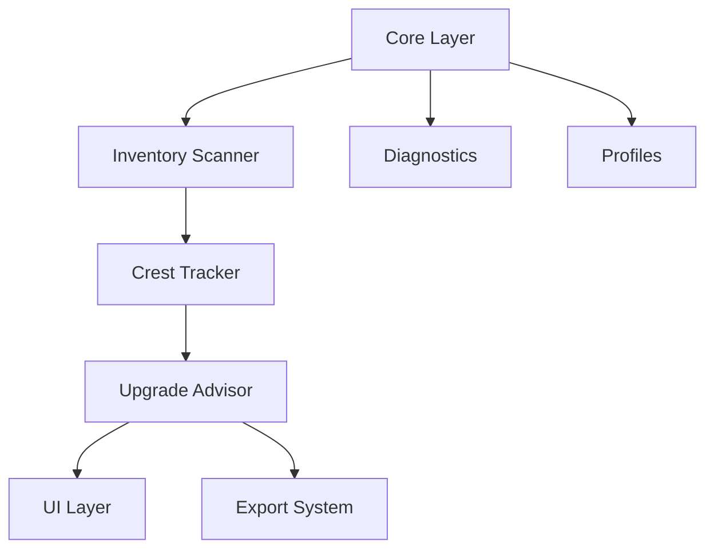

# GearCrester Architecture Diagram (Clean Portrait Version)

This is a high‑level architecture diagram.
Each subsystem is shown as a single block for readability.
A detailed file‑level breakdown is included below the diagram.

Qwen MUST update this diagram whenever architecture changes.

---

## Subsystem File Breakdown

### **Core Layer**

- Init.lua
- Events.lua
- DataModel.lua
- Constants.lua
- Utils.lua

### **Inventory Scanner**

- ScannerCore.lua
- ScannerEquipped.lua
- ScannerBags.lua
- ScannerBank.lua

### **Crest Tracker**

- CrestData.lua
- CrestCaps.lua
- ResetTimer.lua

### **Upgrade Advisor**

- AdvisorCore.lua
- AdvisorLogic.lua
- AdvisorData.lua
- UpgradeOrder.lua
- FreeUpgrade.lua
- AdvisorUI.lua

### **UI Layer**

- MainFrame.lua
- InventoryOverview.lua
- SlotList.lua
- Heatmap.lua
- TooltipExtensions.lua

### **Export System**

- ExportCore.lua

### **Diagnostics**

- SelfTest.lua

### **Profiles**

- DefaultProfiles.lua
- ProfileManager.lua

---

This is a **living diagram**.
Qwen MUST update both the diagram and the file breakdown whenever modules change.
