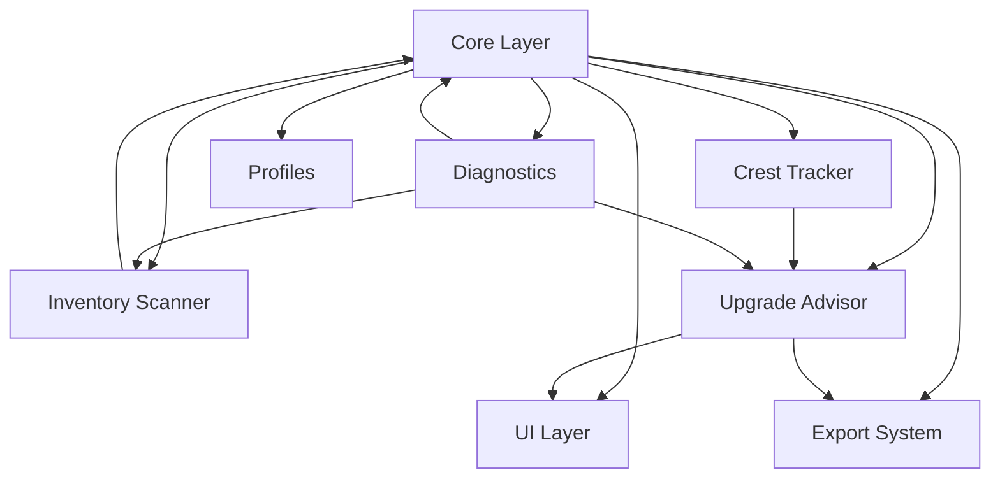

# GearCrester Dependency Map (Clean Portrait Version)

This diagram shows the high‑level dependencies between GearCrester subsystems.
Each subsystem is represented as a single node for clarity.
Qwen MUST update this diagram whenever dependencies change.

---

## Subsystem Dependency Notes

### **Core Layer**

- Foundation for all systems
- Provides events, data model, constants, utilities

### **Inventory Scanner**

- Depends on Core (events, data model)
- Feeds item data back into Core

### **Crest Tracker**

- Independent logic
- Advisor consumes crest data

### **Upgrade Advisor**

- Depends on Core, Crest Tracker, and Scanner data
- Drives UI and Export

### **UI Layer**

- Depends on Advisor and Core

### **Export System**

- Depends on Advisor and Core

### **Diagnostics**

- Depends on Core, Scanner, Advisor

### **Profiles**

- Depends on Core only

---

This is a **living dependency map**.
Qwen MUST update it automatically whenever modules or dependencies change.
